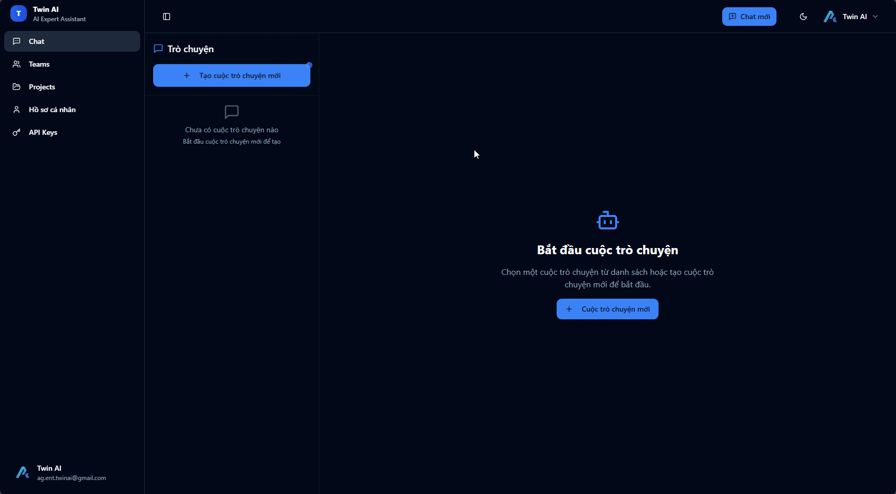

# 3.1. Không gian làm việc của bạn:

Ngay sau khi đăng nhập, bạn sẽ được chào đón bởi một giao diện tinh gọn và mạnh mẽ. Hãy dành vài phút để làm quen với các khu vực chính.

<figure><figcaption></figcaption></figure>

1. **Thanh lựa chọn Twin:** Nơi bạn chọn chuyên gia AI cho từng nhiệm vụ.
2. T**hanh lựa chọn Project:** Nơi bạn có thể bắt đầu một chiến dịch hoặc công việc mới, hoặc lựa chọn một dự án trước đó để làm việc cùng Twin AI.
3. **Cửa sổ trò chuyện** (Chat Window): Trung tâm điều khiển, nơi bạn ra lệnh lần đầu cho Twin để Khởi tạo cuộc trò chuyện
4. **Đính kèm tệp tin:** nơi bạn có thể input tài liệu dưới dạng PDF để Twin có thể phân tích được dữ liệu sản phẩm/thông tin công việc của bạn.
5. Các câu lệnh đơn giản giúp bạn bắt đầu ngay với Twin AI
6. Menu các chức năng chính của Twin AI:

### Khám Phá menu các chức năng chính của Twin AI

Dưới đây, chúng tôi sẽ giải thích ngắn gọn về vai trò của từng khu vực bạn thấy trên menu chức năng

<figure><figcaption></figcaption></figure>

#### **1. Cửa sổ Chat: Trung tâm Sáng tạo**

* **Đây là gì:** Là không gian chính nơi bạn tương tác, ra lệnh và nhận và lưu giữ tất cả phản hồi từ Twin AI. Mọi sản phẩm trí tuệ của bạn đều khởi nguồn từ đây.
* **Bạn sẽ làm gì ở đây:** Đặt câu hỏi, yêu cầu AI viết, phân tích, lên kế hoạch và tinh chỉnh kết quả cho đến khi hoàn hảo.

<figure><figcaption></figcaption></figure>

#### &#x20;**2. Quản lý Teams: Không gian Cộng tác**

* **Đây là gì:** Khu vực cho phép bạn mời, quản lý thành viên và phân quyền trong đội nhóm của mình.
* **Lợi ích:** Thúc đẩy sự cộng tác, chia sẻ dự án và đảm bảo mọi người cùng làm việc trên một nền tảng chung, xem mục <a href="../4.-quan-ly-teams-cua-ban/" class="button primary">Quản lý teams của bạn</a>

<figure><figcaption></figcaption></figure>

#### **3. Quản lý Projects: Ngăn chứa Công việc**

* **Đây là gì:** Là nơi bạn tạo, tổ chức và lưu trữ các dự án riêng biệt. Mỗi dự án giống như một thư mục chứa tất cả các cuộc hội thoại và tài liệu liên quan đến một công việc cụ thể.
* **Lợi ích:** Giúp bạn giữ cho không gian làm việc luôn gọn gàng, tách biệt các chiến dịch, khách hàng hoặc mục tiêu khác nhau, xem mục <a href="3.3.-quan-ly-cong-viec-voi-projects.md" class="button primary">Quản lý công việc với Project</a>

<figure><figcaption></figcaption></figure>

#### **4. Hồ sơ cá nhân & Cài đặt**

* **Đây là gì:** Nơi bạn quản lý thông tin tài khoản cá nhân, thay đổi mật khẩu, xem gói dịch vụ đang sử dụng và thực hiện các cài đặt chung.
* **Hãy bắt đầu từ đây:** Nếu bạn là người dùng mới, hãy truy cập khu vực này để cập nhật thông tin và làm quen với các thiết lập tài khoản, xem mục <a href="../1.-khoi-tao-va-quan-ly-tai-khoan/1.2.-thiet-lap-ho-so-ca-nhan.md" class="button primary">Thiết lập hồ sơ cá nhân</a>

<figure><figcaption></figcaption></figure>

**5. API Keys: Cổng kết nối cho Nhà phát triển**

* **Đây là gì:** Khu vực dành riêng cho người dùng có nhu cầu kỹ thuật, nơi bạn có thể tạo và quản lý các khóa API để tích hợp sức mạnh của Twin AI vào các ứng dụng và hệ thống khác của riêng bạn.
* **Đối tượng:** Dành cho developers hoặc người dùng nâng cao.

<figure><figcaption></figcaption></figure>
