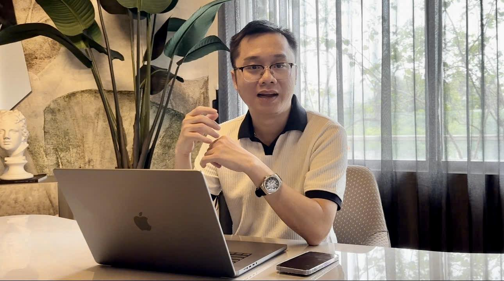

# Chào mừng đến với Twin AI

#### Chào mừng đến với Twin AI

Chào mừng bạn,

Cảm ơn bạn đã tham gia cùng team mình trong hành trình này. Twin AI được sinh ra từ một câu hỏi đơn giản: "Nếu AI không chỉ trả lời, mà còn có thể tư duy cùng chúng ta thì sao?"

Twin AI, một không gian được tạo ra không chỉ để cung cấp câu trả lời, mà để khuếch đại khả năng đặt câu hỏi của chính bạn. Team mình tin rằng đỉnh cao của công nghệ không phải là thay thế, mà là trở thành đối tác tư duy không thể thiếu của con người.

Tại Twin AI, team mình không xây dựng một công cụ. Team mình đang kiến tạo nên những người đồng hành trí tuệ, những "bản thể số" (Digital Twins) được kế thừa và chắt lọc từ kiến thức, quy trình và phương pháp luận của những chuyên gia hàng đầu. Sứ mệnh của team mình là trao cho bạn một lợi thế không công bằng: sức mạnh để tư duy sâu hơn, sáng tạo đột phá hơn và thực thi công việc với một hiệu suất chưa từng có.

**Hành trình của bạn với Twin AI bắt đầu từ đây. Hãy cùng nhau khai mở những giới hạn mới.**

<figure><figcaption></figcaption></figure>

> _"Chúng tôi không tạo ra một công cụ thay thế con người. Chúng tôi tạo ra một 'phân thân' để nâng cấp năng lực của chính bạn."_
>
> 
Huỳnh Xuân Tùng, Founder Twin AI

